```mermaid
flowchart TB
    subgraph current["CSharpRagApp.Tests.csproj"]
        MAIN["<b>📦&nbsp;CSharpRagApp.Tests.csproj</b><br/><small>net10.0</small>"]
        click MAIN "#csharpragapptestscsharpragapptestscsproj"
    end
    subgraph downstream["Dependencies (1"]
        P1["<b>📦&nbsp;CSharpRagApp.csproj</b><br/><small>net8.0</small>"]
        click P1 "#csharpragappcsharpragappcsproj"
    end
    MAIN --> P1

```

```mermaid
flowchart TB
    subgraph upstream["Dependants (1)"]
        P2["<b>📦&nbsp;CSharpRagApp.Tests.csproj</b><br/><small>net10.0</small>"]
        click P2 "#csharpragapptestscsharpragapptestscsproj"
    end
    subgraph current["CSharpRagApp.csproj"]
        MAIN["<b>📦&nbsp;CSharpRagApp.csproj</b><br/><small>net8.0</small>"]
        click MAIN "#csharpragappcsharpragappcsproj"
    end
    P2 --> MAIN

```

# Projects and dependencies analysis

This document provides a comprehensive overview of the projects and their dependencies in the context of upgrading to .NETCoreApp,Version=v10.0.

## Table of Contents

- [Executive Summary](#executive-Summary)
  - [Highlevel Metrics](#highlevel-metrics)
  - [Projects Compatibility](#projects-compatibility)
  - [Package Compatibility](#package-compatibility)
  - [API Compatibility](#api-compatibility)
- [Aggregate NuGet packages details](#aggregate-nuget-packages-details)
- [Top API Migration Challenges](#top-api-migration-challenges)
  - [Technologies and Features](#technologies-and-features)
  - [Most Frequent API Issues](#most-frequent-api-issues)
- [Projects Relationship Graph](#projects-relationship-graph)
- [Project Details](#project-details)

  - [CSharpRagApp.Tests\CSharpRagApp.Tests.csproj](#csharpragapptestscsharpragapptestscsproj)
  - [CSharpRagApp\CSharpRagApp.csproj](#csharpragappcsharpragappcsproj)

## Executive Summary

### Highlevel Metrics

| Metric | Count | Status |
| :--- | :---: | :--- |
| Total Projects | 2 | 1 require upgrade |
| Total NuGet Packages | 11 | 4 need upgrade |
| Total Code Files | 5 |  |
| Total Code Files with Incidents | 3 |  |
| Total Lines of Code | 775 |  |
| Total Number of Issues | 24 |  |
| Estimated LOC to modify | 19+ | at least 2.5% of codebase |

### Projects Compatibility

| Project | Target Framework | Difficulty | Package Issues | API Issues | Est. LOC Impact | Description |
| :--- | :---: | :---: | :---: | :---: | :---: | :--- |
| [CSharpRagApp.Tests\CSharpRagApp.Tests.csproj](#csharpragapptestscsharpragapptestscsproj) | net10.0 | ✅ None | 0 | 0 |  | DotNetCoreApp, Sdk Style = True |
| [CSharpRagApp\CSharpRagApp.csproj](#csharpragappcsharpragappcsproj) | net8.0 | 🟢 Low | 4 | 19 | 19+ | DotNetCoreApp, Sdk Style = True |

### Package Compatibility

| Status | Count | Percentage |
| :--- | :---: | :---: |
| ✅ Compatible | 7 | 63.6% |
| ⚠️ Incompatible | 1 | 9.1% |
| 🔄 Upgrade Recommended | 3 | 27.3% |
| ***Total NuGet Packages*** | ***11*** | ***100%*** |

### API Compatibility

| Category | Count | Impact |
| :--- | :---: | :--- |
| 🔴 Binary Incompatible | 0 | High - Require code changes |
| 🟡 Source Incompatible | 10 | Medium - Needs re-compilation and potential conflicting API error fixing |
| 🔵 Behavioral change | 9 | Low - Behavioral changes that may require testing at runtime |
| ✅ Compatible | 453 |  |
| ***Total APIs Analyzed*** | ***472*** |  |

## Aggregate NuGet packages details

| Package | Current Version | Suggested Version | Projects | Description |
| :--- | :---: | :---: | :--- | :--- |
| Azure.AI.OpenAI | 2.1.0 |  | [CSharpRagApp.csproj](#csharpragappcsharpragappcsproj) | ✅Compatible |
| Azure.Identity | 1.13.2 |  | [CSharpRagApp.csproj](#csharpragappcsharpragappcsproj) | ⚠️NuGet package is deprecated |
| coverlet.collector | 6.0.4 |  | [CSharpRagApp.Tests.csproj](#csharpragapptestscsharpragapptestscsproj) | ✅Compatible |
| FluentAssertions | 8.8.0 |  | [CSharpRagApp.Tests.csproj](#csharpragapptestscsharpragapptestscsproj) | ✅Compatible |
| Microsoft.Extensions.Configuration | 8.0.0 | 10.0.3 | [CSharpRagApp.csproj](#csharpragappcsharpragappcsproj) | NuGet package upgrade is recommended |
| Microsoft.Extensions.Configuration.EnvironmentVariables | 8.0.0 | 10.0.3 | [CSharpRagApp.csproj](#csharpragappcsharpragappcsproj) | NuGet package upgrade is recommended |
| Microsoft.Extensions.Configuration.Json | 8.0.0 | 10.0.3 | [CSharpRagApp.csproj](#csharpragappcsharpragappcsproj) | NuGet package upgrade is recommended |
| Microsoft.NET.Test.Sdk | 17.14.1 |  | [CSharpRagApp.Tests.csproj](#csharpragapptestscsharpragapptestscsproj) | ✅Compatible |
| Moq | 4.20.72 |  | [CSharpRagApp.Tests.csproj](#csharpragapptestscsharpragapptestscsproj) | ✅Compatible |
| xunit | 2.9.3 |  | [CSharpRagApp.Tests.csproj](#csharpragapptestscsharpragapptestscsproj) | ✅Compatible |
| xunit.runner.visualstudio | 3.1.4 |  | [CSharpRagApp.Tests.csproj](#csharpragapptestscsharpragapptestscsproj) | ✅Compatible |

## Top API Migration Challenges

### Technologies and Features

| Technology | Issues | Percentage | Migration Path |
| :--- | :---: | :---: | :--- |

### Most Frequent API Issues

| API | Count | Percentage | Category |
| :--- | :---: | :---: | :--- |
| T:System.Text.Json.JsonDocument | 4 | 21.1% | Behavioral Change |
| T:System.Uri | 3 | 15.8% | Behavioral Change |
| T:System.BinaryData | 2 | 10.5% | Source Incompatible |
| P:System.ClientModel.Primitives.PipelineResponse.Content | 2 | 10.5% | Source Incompatible |
| T:System.ClientModel.Primitives.PipelineResponse | 2 | 10.5% | Source Incompatible |
| M:System.Uri.#ctor(System.String) | 2 | 10.5% | Behavioral Change |
| M:System.ClientModel.ClientResultException.GetRawResponse | 1 | 5.3% | Source Incompatible |
| P:System.ClientModel.ClientResultException.Status | 1 | 5.3% | Source Incompatible |
| M:System.BinaryData.ToString | 1 | 5.3% | Source Incompatible |
| M:System.ClientModel.ClientResult.GetRawResponse | 1 | 5.3% | Source Incompatible |

## Projects Relationship Graph

Legend:
📦 SDK-style project
⚙️ Classic project

```mermaid
flowchart LR
    P1["<b>📦&nbsp;CSharpRagApp.csproj</b><br/><small>net8.0</small>"]
    P2["<b>📦&nbsp;CSharpRagApp.Tests.csproj</b><br/><small>net10.0</small>"]
    P2 --> P1
    click P1 "#csharpragappcsharpragappcsproj"
    click P2 "#csharpragapptestscsharpragapptestscsproj"

```

## Project Details

### CSharpRagApp.Tests\CSharpRagApp.Tests.csproj

#### Project Info

- **Current Target Framework:** net10.0✅
- **SDK-style**: True
- **Project Kind:** DotNetCoreApp
- **Dependencies**: 1
- **Dependants**: 0
- **Number of Files**: 4
- **Lines of Code**: 394
- **Estimated LOC to modify**: 0+ (at least 0.0% of the project)

#### Dependency Graph

Legend:
📦 SDK-style project
⚙️ Classic project

### API Compatibility

| Category | Count | Impact |
| :--- | :---: | :--- |
| 🔴 Binary Incompatible | 0 | High - Require code changes |
| 🟡 Source Incompatible | 0 | Medium - Needs re-compilation and potential conflicting API error fixing |
| 🔵 Behavioral change | 0 | Low - Behavioral changes that may require testing at runtime |
| ✅ Compatible | 0 |  |
| ***Total APIs Analyzed*** | ***0*** |  |

### CSharpRagApp\CSharpRagApp.csproj

#### Project Info

- **Current Target Framework:** net8.0
- **Proposed Target Framework:** net10.0
- **SDK-style**: True
- **Project Kind:** DotNetCoreApp
- **Dependencies**: 0
- **Dependants**: 1
- **Number of Files**: 3
- **Number of Files with Incidents**: 3
- **Lines of Code**: 381
- **Estimated LOC to modify**: 19+ (at least 5.0% of the project)

#### Dependency Graph

Legend:
📦 SDK-style project
⚙️ Classic project

### API Compatibility

| Category | Count | Impact |
| :--- | :---: | :--- |
| 🔴 Binary Incompatible | 0 | High - Require code changes |
| 🟡 Source Incompatible | 10 | Medium - Needs re-compilation and potential conflicting API error fixing |
| 🔵 Behavioral change | 9 | Low - Behavioral changes that may require testing at runtime |
| ✅ Compatible | 453 |  |
| ***Total APIs Analyzed*** | ***472*** |  |

